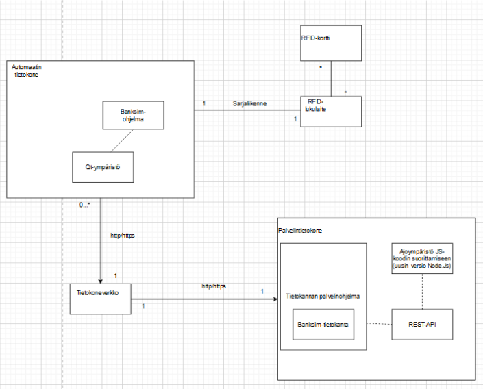
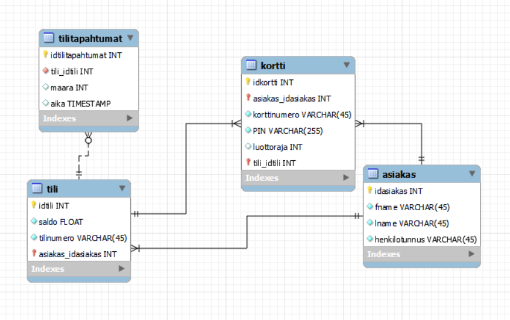
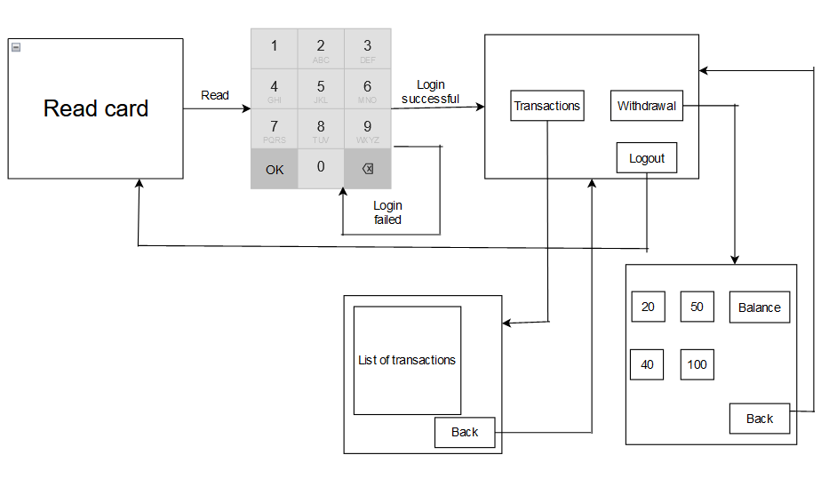

# BankSimul

This project was a part of the OAMK Software Developement Course IN00CS90

About:
The aim of this project was to create an ATM simulator software, and a REST API and database to store the data. MySQL, Express.js and Qt were used in creating said structure. The project also simulated a customer-deliverer relationship with steps and documents, such as:

-Pre-study

-Project contract

-Functional description

-Technical description

Below are examples of diagrams drawn while planning the software:

*The deployment diagram shows used appliances.*

_The ER-diagram describes the structure of the database. This database consists of four tables._

_The UI-diagram describes how the UI works when used._

Built with:

-mySQL - databse

-Express.js - REST API

-Qt - software and GUI
